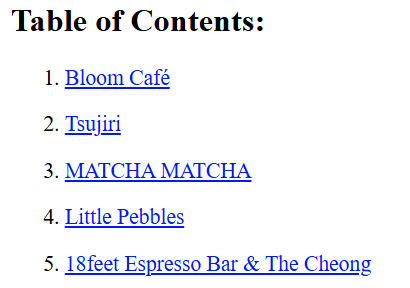

# Welcome to the HTML workshop!

Before you begin coding, take some time to read the head of 
the document to understand the setup for the code you’re 
about to write. 

*Your first task:* With your partner, try to identify the function of each line 
of code for the head, and afterwards check your answers at 
the bottom of this document.

. Add an *h1 element* to create a title on the page, and 
set it to the following text:
```
Café Central : City of Toronto
```
[start=2]

. Add a *p element* below it to give your web page visitors 
more context. Feel free to write up your own description, 
or use the one below:

```
In the heart of Toronto, discover curated reviews that 
highlight the best in coffee, ambiance, and local flavor. 
From cozy corners to modern brews, we guide you to the 
city’s top spots for your next study spot or relaxing 
break - perfect for locals and visitors alike.
```
[start=3]
. Create your first *section element* below it. This will contain all 
the cafés in a list format, so create an *ordered list element* 
nested within it. (Recall: What are the first letters of the
words in “ordered list”?)

. For each café in this page, we should add div elements to 
help us further separate the content. Nest 5 div elements 
in the ordered list element.

. In each div element, nest list elements (Recall: The first 
2 letters of the word “list”) using the following café names (Also, make each of these list elements an *h2*.):
```html 
a. Bloom Café
b. Tsujiri
c. MATCHA MATCHA
d. Little Pebbles
e. 18feet Espresso Bar & The Cheong
```
[start=6]
. Add image elements in each div underneath the h2. Each of the cafés above should source a different image using the appropriate *attribute*. The image addresses are provided below:
* https://thebloomcafe.ca/cdn/shop/files/S__9150471.jpg?v=1737402552&width=3200[Bloom Cafe]
* https://rs-menus-api.roocdn.com/images/bc88c52b-2abd-4ce2-8c7b-7ae20c58e728/image.jpeg[Tsujiri]
* https://encrypted-tbn0.gstatic.com/images?q=tbn:ANd9GcSfuKHRijGRMOIuVqgb8VQIsLogCmJQcY6bhA&s[Matcha Matcha]
* https://static1.squarespace.com/static/53c331c1e4b080b39b0c5d2b/5860767615d5db976891e211/5ff6747b0f33e155f3b841a4/1743963517088/FAA84A38-7A09-489F-B19C-ABDDF785F593-87015970-6216-4BD2-B35A-F9AFAA4BE868.JPG?format=1500w[Little Pebbles]
* https://cdn.prod.website-files.com/66bd14e35b030782dda158f2/67a2e60fb8a2c409b2b60c6c_Screenshot%202025-02-04%20at%2011.14.17%E2%80%AFPM%201.png[18feet Espresso Bar & The Cheong]
[start=7]
. *SYNTAX CHECK!* At this point, double check that your syntax is correct, if you haven’t already. A good thing to look out for is any red text, as the editor is telling you that there
is a problem with some code you’ve written in that area.
Common mistakes include:
* not closing non-void elements with a closing tag
* adding an extra closing tag on void elements (which is unnecessary)
* any spelling errors
* not working within the tags you intended to (pay special attention to your
nesting order! all the info for each café should be located in its respective div
element.)
If there are errors in your code you can’t figure out, call us over and we’ll help!

[start=8]
. Now it’s time to add descriptions for each café - we’ll do this using p elements under
each image. You may use the descriptions below:
* Bloom Café on Yonge offers a minimalist, serene space with
Japanese-inspired desserts like earl grey cream puffs and
mochi. Enjoy premium teas and lattes in a cozy, light-filled
setting perfect for quiet breaks or studying.
* Tsujiri on Dundas Street West offers a serene, minimalist
space rooted in Japanese tea tradition. Known for its
authentic matcha, it’s a must-visit for those seeking a
genuine and refined green tea experience.
* Matcha Matcha on Church Street is a sleek, modern café known
for its creative matcha-based drinks. With a minimalist vibe
and self-serve kiosks, it’s a go-to spot for matcha lovers
seeking something refreshingly different.
* Little Pebbles is a cozy café known for its warm atmosphere
and exceptional croissants made with rich European butter.
It’s the perfect spot to relax, enjoy delicious pastries, and
savor specialty coffees in the city.
* 18 feet Espresso Bar & The Cheong is a vibrant café blending
Korean flavors with modern coffee culture. Known for
innovative drinks and a cozy atmosphere, it’s a favorite spot
for those seeking a unique and flavorful experience.

. Finally, add an *<hr> void element underneath each of the paragraph elements*. This element simply adds a horizontal line that spans the width of the page, but it helps to visually separate the content.

We’re done with the main content of this page! If you have the time, you might want to
try your hand at the challenge below, which involves some HTML you’re familiar with and
also a bit of reading on new topics. This can be challenging! Take your time, and if you need
help just call us over :)

## Challenge: Adding a Table of Contents

Let’s add one more thing: a table of contents. Underneath the original paragraph element located under the heading of our web page, add a *section element*.

. Create an h2 element nested within the section element with the text below:
```
Table of Contents
```
[start=2]
. Create another ordered list element beneath it, and add 5 list elements.
The point of this table of contents is to give our readers an easy way to access each of the cafés we’re listing, so we’re going to make them clickable links by using the *anchor element (<a> </a>)*.

Recall that the anchor element has an *href attribute* that you can attach links to; linking to either other web pages or sections within your document. This is why we took the time to separate each list element into *div elements*, to make it easier for us to set up the table of contents!

Again, here is an example of the code behind a link to YouTube: https://www.youtube.com/[Link text displayed]
```
<a href=”https://www.youtube.com/”> <p> Link text displayed </p> </a>
```
Using the anchor element with a section in your webpage is similar, but you need to define the
section you’re linking to with an *id selector*.
For example, if I had an anchor element with an href attribute of *#my-link*, I would need an *h1 element* with an *id selector* of *my-link* for it to properly link to the respective section:
```
<a href=”#my-link”> <p> Link to a different section </p> </a> ...
<h1 id=”my-link”> This is the heading that the anchor attribute links to </h1>
```
Now that you’ve seen an example of using the anchor attribute, try to implement it!

You can use whichever id’s you want (as a suggestion, you might want to use the names of the cafes for simplicity), just make sure to declare the id attribute in the opening tag each café’s div element, and make sure they match the respective href attribute in each list element in the table of contents.

The desired output is as follows, with each entry being a clickable link to the respective section of your web page:



## Solutions: 
```html
<!-- 
The solutions to the head activity for the HTML workshop for CREATE 2025: SWE
-->
<!DOCTYPE html> <!-- Tells you the document type -->
<html lang="en"> <!-- Tells you the document language -->

<head>
  <meta charset="UTF-8" /> <!-- The character set for the document, allowing the usage of characters like é -->
  <meta name="viewport" content="width=device-width, initial-scale=1.0" /> <!-- Allows scaling based on size of the browser -->
  <link rel="stylesheet" href="styles-complete.css" /> <!-- The stylesheet for the document - ignore for now! -->
  <!-- Below are the font families used, ignore for now. -->
  <link rel="stylesheet" href="https://fonts.googleapis.com/css?family=Sofia">
  <link rel="stylesheet" href="https://fonts.googleapis.com/css?family=Winky Rough">
  <link rel="stylesheet" href="https://fonts.googleapis.com/css?family=Sorts Mill Goudy">
  <link rel="stylesheet" href="https://fonts.googleapis.com/css?family=Literata">
  <!-- The title of the website displayed on the browser tab. -->
  <title>Cafés Near You!</title>
</head>
```
