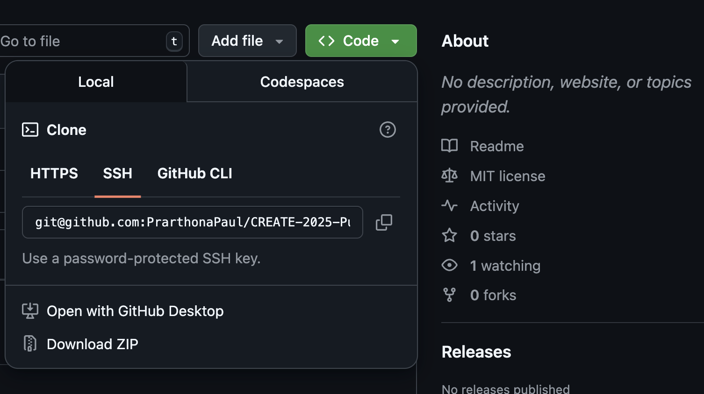

# GitHub Setup Activity Introduction
Welcome to the GitHub setup activity! In this activity, you will learn about git, Github and get a chance to create and set up your account on the lab computers! 

## What are git and GitHub?
Recall that git is a version control system that allows people to work on software projects together. Git keeps track of all the changes created by each member of the team, and allows file sharing between team members. 

Since git is a tool used through the command line interface (CLI), GitHub offers an interface to use some of the git functions, and host git repositories (or projects) online. GitHub offers a visual graphics based interface that offers a more beginner friendly access to your git repositories. 

## Setting up GitHub on the Lab Computers
The following set of instructions will walk you through how to create a GitHub account and access your repos using git through the CLI. 

### Create a GitHub Account
NOTE: Skip to the next section if you already have a GitHub account.

. Navigate to https://github.com/ 
** Click on the "Sign up" button. 
** You will be asked to enter the following information: 
*** Your email (Use an email account that you can access in a few minutes)
*** A password (Make sure it is something you can remember. Your password should be at least 15 characters OR at least 8 characters including a number and a lowercase letter.) 
*** A username (make sure this is appropriate)
*** Your country/region 
** Click on "Continue"
. Once you have created your account successfully, you will be directed to your home page. If you are prompted to log in, please do so using the username and password you just selected. 

### Log in to Your Account
NOTE: You can skip this section if you are already able to access your github dashboard. 

. Visit https://github.com/ using a browser on the lab computer that you are logged into and click on the "Sign in" button. 
. SIgn in using your credentials.
** If you are prompted to perform any Two-factor authentication, please select the "send code via SMS" one if possible. Even if you usually use the passkey on your own device, this will not work on the lab computers.  

### Accessing Repositories from Git
Now that we have successfully logged onto GitHub, let's access it using the terminal so we can create a local version of a repository (the version of the repository that you'll commit changes to). 

#### Create an SSH Key

To create a local version of a repository, you need an SSH key which your computer will use to communicate with GitHub. You can think of an SSH key as a way for your computer to ensure that only authorized users (like you!) are accessing the repository on GitHub.

* Open the terminal on your computer. You can do so by pressing on the Windows button on your keyboard, which brings up all the apps on the computer. From there, search for "Terminal", and open it. It should look something like this: 

image::https://www.tecmint.com/wp-content/uploads/2022/06/AlmaLinux-9-Info.png[]

* Change directory (cd) to the .ssh directory using the command below: 
```
cd ~/.ssh
```
* Paste the text below, replacing the email used in the example with your GitHub email address.
```
ssh-keygen -t ed25519 -C "your_email@example.com"
``` 
* This creates a new SSH key, using the provided email as a label.
```
> Generating public/private ALGORITHM key pair.
```
* When you're prompted to "Enter a file in which to save the key", you can press Enter to accept the default file location.
```
> Enter a file in which to save the key (/home/YOU/.ssh/id_ALGORITHM):[Press enter]
```
* Now you will need to enter a password for this file. You can set this to be something simple you remember. 

NOTE: As you type in the password, you will not see the screen change. However, the terminal is still taking in your input. 

```
> Enter passphrase (empty for no passphrase): [Type a passphrase]
> Enter same passphrase again: [Type passphrase again]
```

#### Allow Your Computer to Use The SSH Key
Now that we have created an SSH key, we need to allow our computer to use it when communicating with GitHub: 

* First, let's activate the agent (that will store our SSH key on the computer) using the command below: 
```
eval "$(ssh-agent -s)"
```
* Now direct the agent to use the key you just created: 
```
ssh-add ~/.ssh/id_ed25519
```
#### Adding SSH Key to GitHub
Since we are using the key to communicate with GitHub, we also need to add our key to it.

* First we need to copy the key. We'll print out the key's information using the command below: 
```
cat ~/.ssh/id_ed25519.pub
```
* Then copy the output displayed in the terminal to your clipboard (Ctrl+C). 
* Go back to your GitHub account at https://github.com/. 
* Click on your profile picture at the top right corner and click on "Settings".  
* On the left hand side, you will see a sidebar of different options. Click on `SSH and GPG keys`
* Next to SSH Keys, click on the green button that says "New SSH Key". 
** For "Title", enter "Create-key", 
** For "Key type", you can keep it as "Authentication Key", 
** For "Key", paste the key you copied from the terminal.
* Click on the green button that says "Add SSH Key". 

You should now be able to access your project repositories using Git. Let's try it out! 

### Accessing Git Repos Through the Terminal
We need to first create a repository to access, since we don't have one yet.

* Click on your profile picture and go to "Your Repositories". 
* Click on the green button that says "New". 
* Set the repository name to be "Create-trial-YOUR-NAME". Replace YOUR-NAME with your name. Scroll down to click on "Create Repository".
* Now if you go back to your repositories, you should see the one you just created. 
* Click on the name of the repo, and click on the green button that says "Code". 
* It will reveal a menu like this: 



* Click on SSH and copy the link you see below. 

* In your file system, create a folder called CREATE-SWE-2025, and change your current directory to it in the terminal. Use the following command to do so (change path/to/CREATE-SWE-2025 with the actual folder path to CREATE-SWE-2025): 
```
cd path/to/CREATE-SWE-2025
```

* Now paste the following command on your terminal: 
```
git clone <link you copied from github>
```
This should create a new folder with the same name as your repository. You can check by using the following command: 
```
ls
```
### Making a Change to the Git Repo
Now that we have accessed our git repo, let's make and push a change to it.

* Use the file system to navigate to the repository and create a new text file (.txt). 
* Go back to the terminal and type in the command below. This should give you a summary of the local changes made to your repo.   
```
git status
```
* Type in the following commands in your terminal to add the files to your index, so you can push it to the remote copy of your repo replacing <your file name> with the name of your file: 
```
git add <your file name> 
```
* Now we want to commit our changes with a descriptive comment that explains the changes made in that commit: 
```
git commit -m "Added a new text file."
```
* Now we are ready to push using the following code: 
```
git push 
```
Now if you go back to your repo on github, you should see the new file, as well as the new commit you just created! 
